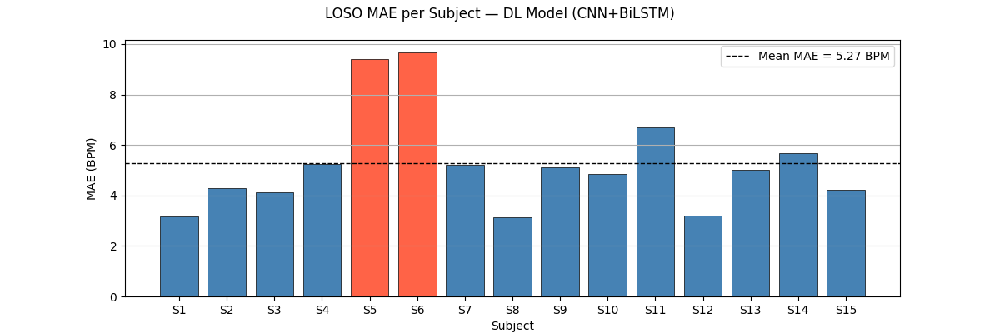
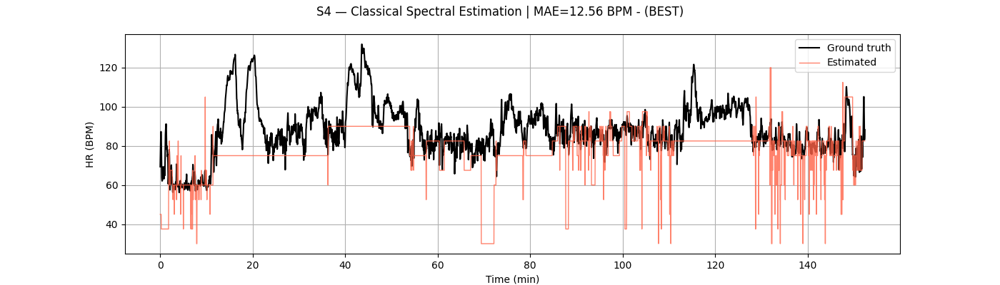

# ppg-hr-estimation

 

Heart rate estimation from wrist-worn PPG and 3-axis accelerometer data (PPG-DaLiA dataset), comparing a classical DSP baseline against a deep learning (CNN+BiLSTM) approach.

**Result:** 5.27 ± 1.93 BPM MAE (leave-one-subject-out CV, 15 subjects) with the deep learning model, vs. 19.24 BPM MAE for the classical spectral-peak baseline.

**Reference:** Reiss et al., "Deep PPG: Large-Scale Heart Rate Estimation with Convolutional Neural Networks," MDPI Sensors, 2019.

## Approach
1. **[00_eda](notebooks/00_eda)** — Explore the PPG-DaLiA dataset structure, signals, and ground-truth HR for a single subject; establish preprocessing design.
2. **[01_preproc](notebooks/01_preproc)** — Resample, filter, window, and normalize PPG/ACC signals for all 15 subjects.
3. **[02_clean](notebooks/02_clean)** — Investigate motion-artifact removal (NLMS adaptive filtering, EMD); document why these didn't improve results.
4. **[03_trad](notebooks/03_trad)** — Classical FFT-based spectral peak HR estimator with ACC-based motion penalty (baseline).
5. **[04_dl](notebooks/04_dl)** — CNN+BiLSTM deep learning model, evaluated via leave-one-subject-out cross-validation.

## Results

| Approach | Method | MAE (BPM) |
|---|---|---|
| Classical DSP | FFT spectral peak selection + ACC penalty | 19.24 |
| Deep Learning | CNN + BiLSTM, LOSO CV | 5.27 ± 1.93 |

Deep learning LOSO fold range: 3.12–9.68 BPM (4.61 BPM excluding two outlier subjects, S5/S6, with atypical HR distributions).





## Setup

```
python -m venv venv

source venv/bin/activate

pip install -r requirements.txt

python -m ipykernel install --user --name=ppg-hr-estimation --display-name "ppg-hr-estimation"
```

